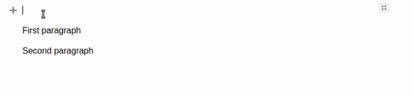

# EditorJS Drag/Drop Plugin


[](https://coveralls.io/github/kommitters/editorjs-drag-drop)
[](https://bestpractices.coreinfrastructure.org/projects/6468)
[](https://api.securityscorecards.dev/projects/github.com/kommitters/editorjs-drag-drop)

Drag/Drop feature for [Editor.js](https://editorjs.io).



## Installation

### Install via NPM

Get the package

```shell
$ npm i --save-dev editorjs-drag-drop
```

Include module at your application

```javascript
import DragDrop from "editorjs-drag-drop";
```

### Load from CDN

You can load a specific version of the package from [jsDelivr CDN](https://www.jsdelivr.com/package/npm/editorjs-drag-drop).

Require this script on a page with Editor.js.

```html
<script src="https://cdn.jsdelivr.net/npm/editorjs-drag-drop"></script>
```

## Usage

Add the plugin to the onReady property of the Editor.js configuration to initialize it:

```javascript
const editor = new EditorJS({
  onReady: () => {
    new DragDrop(editor);
  },
});
```

You can customize the indicator border style by passing a second parameter to the plugin constructor:

```javascript
const editor = new EditorJS({
  onReady: () => {
    new DragDrop(editor, "2px solid #fff");
  },
});
```

If no parameter is provided, the default border style `1px dashed #aaa` is used.

Select the block, drag the toolbar settings button, and drop it at the desired position.

### Integration with editorjs-undo

If you're already using [editorjs-undo](https://github.com/kommitters/editorjs-undo), your code might look like this:

```javascript
const editor = new EditorJS({
  onReady: () => {
    new Undo({ editor });
    new DragDrop(editor);
  },
});
```

### Usage with React.

If you are using React, you could create a function to handle the onReady property, the function will store the DragDrop instance. Then, you must call the function in onReady in the editorJS instance.

```javascript
const handleReady = (editor) => {
  new DragDrop(editor);
};

class ReactEditor extends Component {
  render() {
    return (
      <EditorJs
        onReady = { handleReady }
        tools = { ... }
      />
    )
  }
}
```

**Note:** If you are also using [editorjs-undo](https://github.com/kommitters/editorjs-undo) your handleReady function must have the editorjs-undo instance as well.

```javascript
const handleReady = (editor) => {
  new Undo({ editor });
  new DragDrop(editor);
};
```

### Usage with [react-editor-js](https://github.com/Jungwoo-An/react-editor-js).

If you are using [react-editor-js](https://github.com/Jungwoo-An/react-editor-js), you should use the 'onInitialize' prop in the ReactEditorJS component to obtain the abstract editorjs as follow:

```javascript
........
export const ReactEditor = () => {
  const editorCore = React.useRef(null)

  const handleInitialize = React.useCallback((instance) => {
    editorCore.current = instance
  }, [])

  const handleReady = () => {
    const editor = editorCore.current._editorJS;
    new Undo({ editor })
    new DragDrop(editor);
  };

  const ReactEditorJS = createReactEditorJS()
  return(
  <ReactEditorJS
    onInitialize={handleInitialize}
    onReady = {handleReady}
    tools={....}
    defaultValue={....}
  />
  )
}
```

## Development

**Development mode**

```shell
$ yarn build:dev
```

**Production release**

1. Create a production bundle

```shell
$ yarn build
```

2. Commit `dist/bundle.js`

**Run tests**

```shell
$ yarn test
```

## Code of conduct

We welcome everyone to contribute. Make sure you have read the [CODE_OF_CONDUCT][coc] before.

## Contributing

For information on how to contribute, please refer to our [CONTRIBUTING][contributing] guide.

## Changelog

Features and bug fixes are listed in the [CHANGELOG][changelog] file.

## License

This library is licensed under an MIT license. See [LICENSE][license] for details.

## Acknowledgements

Made with 💙 by [kommitters Open Source](https://kommit.co)

[license]: https://github.com/kommitters/editorjs-drag-drop/blob/master/LICENSE
[coc]: https://github.com/kommitters/editorjs-drag-drop/blob/master/CODE_OF_CONDUCT.md
[changelog]: https://github.com/kommitters/editorjs-drag-drop/blob/master/CHANGELOG.md
[contributing]: https://github.com/kommitters/editorjs-drag-drop/blob/master/CONTRIBUTING.md
